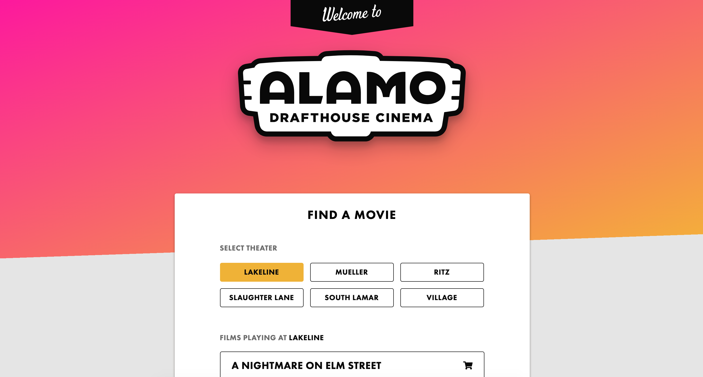

# Alamo Drafthouse Test
This is a test I did for Alamo Drafthouse movie theaters.

## Installation

1. Clone repo-> Run `git clone https://github.com/gitjameshooper/alamo-drafthouse-test.git` in your terminal
2. Install [Node.js](https://nodejs.org/en/download/)
3. Install Node Modules-> Run `npm i` in your terminal.

## Basic Usage

* Then go into the alamo-app directory -> `cd alamo-drafthouse-test/alamo-app`
* Serve the app -> Run `npm start` in your terminal.
* Now you can view the app in localhost:4200 in your browser

## Built Using

* Node
* Angular 7
* RXJS
* Bootstrap 4